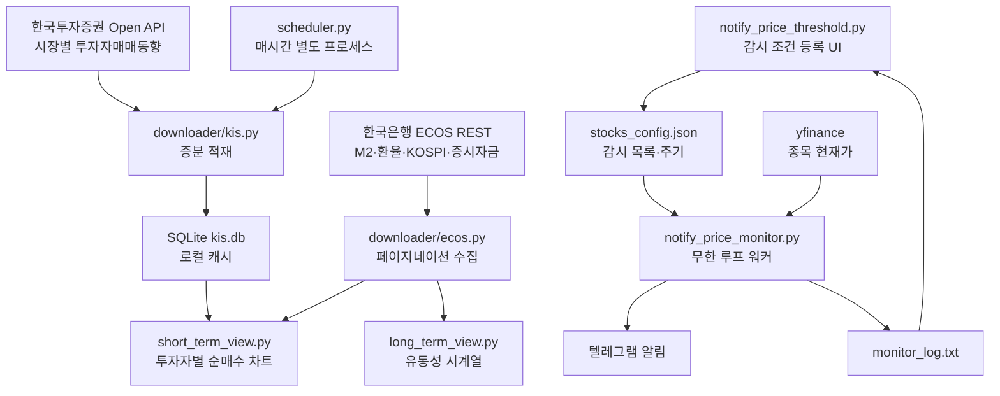

# Investment Dashboard: KOSPI 수급·유동성 대시보드와 가격 감시 알림 워커

> 디렉터(Mike)가 2025년 11월부터 2026년 1월까지 80일 구간에 걸쳐 단독 개발한 개인용 투자 대시보드를,
> Aether Turing Dynamics(ATD)가 편입하여 등재한 기술 케이스 스터디입니다.
> ATD는 기능 구현에 참여하지 않았습니다.

---

## 1. 프로젝트 목적 및 배경 (Goal & Mission)

### 해결 과제: 시장 수급과 유동성을 한 화면에서 보기 어렵다

개인 투자자가 "지금 시장에서 누가 사고 있는가"를 확인하려면 증권사 화면, 한국은행 통계, 뉴스를 각각 오가야 합니다. 외국인·기관·개인의 순매수는 증권사 앱에서 보고, 시중 통화량(M2)과 증시 자금은 한국은행 경제통계시스템에서 따로 찾고, 환율과 지수는 또 다른 화면에서 봅니다. 숫자는 파편으로 흩어져 있고, 어제 대비 얼마나 달라졌는지는 직접 계산해야 합니다.

별개의 문제가 하나 더 있습니다. 보유 종목이 미리 정해 둔 가격에 닿는 순간을 놓치지 않는 일입니다. 사람이 장중에 화면을 계속 들여다볼 수는 없으므로, 조건을 등록해 두고 조건이 충족될 때 알림을 받는 구조가 필요합니다.

### 프로젝트 핵심 목표

1. 투자자별 순매수와 시장지수, 유동성 지표를 한 화면에서 조회하고 차트로 비교한다.
2. 공식 API(한국투자증권 Open API, 한국은행 ECOS)에서 데이터를 직접 받아 로컬에 캐시한다.
3. 감시 종목과 조건을 등록하면 백그라운드 워커가 주기적으로 가격을 확인해 텔레그램으로 알린다.
4. 모든 처리를 로컬에서 수행하고, 자격증명은 저장소 밖에 둔다.

---

## 2. 개발 및 ATD 편입 경과

### 2-1. 디렉터 단독 개발 (2025.11.02 ~ 2026.01.20)

디렉터가 80일 구간에 걸쳐 단독으로 개발했습니다. 커밋 26개이며 실제 작업이 있었던 날은 9일입니다. 2025년 11월 2일부터 6일까지 시장 데이터 조회와 차트 화면이 만들어졌고, 11월 11일부터 12일까지 분석 노트북과 ECOS 통계코드 수집 도구가 추가되었습니다. 이후 약 두 달의 공백을 두고 2026년 1월 14일과 20일에 가격 감시 알림 파이프라인과 KIS 인증 모듈이 보강되었습니다.

코드 규모는 추적 중인 Python 3,500행이며, 분석 노트북 `analysis/kospi/kospi_analysis.ipynb`가 5,828행으로 저장소 텍스트의 상당 부분을 차지합니다.

### 2-2. ATD 편입 등재 (2026.09.22)

1월 완성 이후 변경 없이 남아 있던 저장소를 ATD 허브에 편입했습니다. 이 프로젝트는 ATD 편성 하에 개발된 것이 아니므로 ATD는 기능 구현에 참여하지 않았습니다.

이번 편입은 등재 범위로 한정했습니다. 아래 표에서 취소선 없이 표시된 단계만 실제로 수행했습니다.

| 단계 | 담당 | 수행 내용 |
| :--- | :--- | :--- |
| 기준선 확정 | Atlas | `git fetch --all` 후 `origin/main...HEAD` 0/0 대조, HEAD와 커밋 수 확정 |
| 전수 분석 | Atlas | 코드베이스·데이터 흐름·이력 분석, 시크릿 커밋 여부 판정 |
| 에셋 제작 | Sora | 대표 썸네일 제작 |
| 등재 | Chloe | 허브 레지스트리 등록 및 중앙 서버 기여 파이프라인 실행 |
| 아키텍처 명세 | Leo | 미수행 — 백로그 이관 |
| 결함 해소 | Kai | 미수행 — 백로그 이관 |
| 감사 | Elena | 미수행 — 백로그 이관 |
| 검증 | Noah | 미수행 — 백로그 이관 |

감사와 검증을 수행하지 않았으므로 이 문서는 이 코드베이스의 품질을 보증하지 않습니다. §4에 정리한 내용은 전수 분석에서 확인된 사실이며 등급 판정이 아닙니다.

---

## 3. 시스템 구조 및 핵심 기술

### 3-1. 실행 구조: 서로 호출하지 않는 세 개의 프로세스

이 저장소의 실행 단위는 세 갈래이며, 서로를 호출하지 않습니다.

| 진입점 | 역할 |
| :--- | :--- |
| `dashboard/index.py` | Streamlit 앱. `st.navigation`으로 6개 화면을 등록하고 실행합니다 (`index.py:13-20`). |
| `dashboard/scheduler.py` | 독립 스케줄러 프로세스. `schedule.every().hour`로 매시간 KIS 데이터를 내려받고 데몬 스레드로 대기합니다 (`scheduler.py:34-38`). |
| `dashboard/pages/notify_price_monitor.py` | 알림 워커. 무한 루프로 종목 가격을 확인합니다 (`notify_price_monitor.py:121-150`). |

`scheduler.py`는 `index.py`에서 임포트되지 않습니다. Streamlit 화면과 데이터 적재가 분리되어 있어, 화면을 띄우지 않아도 데이터가 쌓입니다.

### 3-2. KIS 데이터 파이프라인: 증분 적재와 로컬 캐시

한국투자증권 Open API 중 "시장별 투자자매매동향(일별)" 한 종류만 사용합니다 (`kis.py:83`). 조회 대상은 KOSPI로 고정되어 있습니다 (`kis.py:157-160`).

핵심은 증분 적재입니다. 로컬 SQLite(`kis.db`)에 이미 있는 최신 날짜를 확인하고, 그 이후 구간만 API에서 받아 `to_sql(if_exists='append')`로 덧붙인 뒤 전체를 다시 조회해 반환합니다 (`kis.py:175-186`, `:203-236`). API 응답이 100건 단위로 끊기는 문제는 직전 조회의 마지막 날짜를 추적하는 루프로 이어붙였습니다 (`kis.py:228-233`). 요청마다 전 구간을 다시 받지 않게 만든 실질적 설계입니다.

응답 컬럼 40여 개에 대해 한글명과 의미 설명을 붙인 매핑 테이블을 별도로 두었습니다 (`kis.py:29-72`, `config/__init__.py:30-237`). API 문서를 옆에 두지 않아도 코드만으로 컬럼 의미를 알 수 있게 한 처리입니다.

### 3-3. ECOS 연동: 페이지네이션과 현재값 대비 평균

한국은행 ECOS에서는 통계표 4종을 조회합니다. M2 통화지표(`101Y006`) 5개 항목, 원/달러 환율(`731Y001`), KOSPI 지수(`802Y001`), 증시자금 동향(`901Y056`) 6개 항목입니다 (`ecos.py:174-222`).

ECOS 응답은 `list_total_count`까지 `start_index`를 밀어가며 반복 수집합니다 (`ecos.py:126-143`). 이 처리가 없으면 장기 시계열이 잘리는데, 여기서는 정확히 구현되어 있습니다. 수집한 항목코드는 컬럼명으로 재구성하고(`ecos.py:167-171`) 결측은 0으로 채웁니다.

화면에서는 현재값과 기간 평균의 차이를 함께 보여줍니다 (`short_term_view.py:109-124`). 값 하나만 보면 높은지 낮은지 판단할 수 없으므로 평균 대비 위치를 덧붙인 구성입니다.

### 3-4. 가격 감시 알림 파이프라인

세 파일이 JSON 파일 두 개를 매개로 느슨하게 연결됩니다. 코드를 공유하지 않고 스키마로만 결합되어 있습니다.

- `notify_price_threshold.py` (작성자): 감시 조건을 설정하고 `stocks_config.json`에 저장합니다. 전략 이름을 UI 한글에서 내부 코드로 매핑합니다 — `max_drop`, `min_rise`, `avg_gap`, `atr_trailing` (`notify_price_threshold.py:165-170`). 워커가 남긴 `monitor_log.txt`를 읽어 화면에 표시합니다.
- `notify_price_monitor.py` (소비자): `stocks_config.json`을 읽고 설정된 주기가 지나면 전 종목을 순회해 4개 전략의 조건을 판정합니다 (`notify_price_monitor.py:79-109`). 조건이 충족되면 텔레그램으로 보내고 로그를 남깁니다.
- `notify_price_tester.py` (검증자): 네트워크와 GUI 없이 mock 시계열 4종(stable/crash/rebound/volatile)을 만들어 전략 판정 로직을 재현합니다 (`notify_price_tester.py:64-91`).

가격 조회는 yfinance를 쓰며 `.KS`와 `.KQ` 접미사를 순차 시도합니다 (`notify_price_monitor.py:65-67`). 종목 마스터는 KRX 목록과 네이버 ETF 목록을 합쳐 6자리 종목코드로 정규화하고 1일 캐시를 겁니다 (`notify_price_threshold.py:39-54`).

전략 중 `atr_trailing`은 ATR(Average True Range) 기반입니다. True Range 3요소의 최댓값을 14기간 이동평균으로 눌러 변동성을 재고, 5일 이동평균에서 ATR의 배수를 뺀 값을 지지선으로 삼습니다 (`notify_price_monitor.py:42-54`, `:102-109`). 캔들 변동성을 알림 조건에 쓴 접근으로, 고정 퍼센트 기준보다 시장 상황에 따라 조건이 완만하게 움직입니다.

### 3-5. 화면 구성

`index.py`에 등록된 화면은 6개입니다.

| 화면 | 내용 |
| :--- | :--- |
| `short_term_view.py` | 투자자별 순매수 수량·금액, 환율, KOSPI 지수. 음수는 빨강, 양수는 파랑으로 칠합니다 (`short_term_view.py:213-230`). |
| `long_term_view.py` | M2 통화지표 5종과 증시자금 6종 시계열 (`long_term_view.py:57-102`). |
| `notify_price_threshold.py` | 가격 감시 조건 등록과 감시 목록 편집, 워커 로그 뷰어. |
| `google_trends.py` | Google Trends 위젯 임베드. API 연동이 아니라 iframe 스크립트 삽입이며 기간이 `today 3-m`으로 고정되어 있습니다 (`google_trends.py:8-32`). |
| `links.py` | 한국투자증권 API 포털 링크 모음. |
| `investment_principles.py` | 로컬 마크다운 투자원칙 렌더 (`investment_principles.py:14-16`). |

차트는 `draw_filtered_data` 하나로 일반화되어 x축 유무, bar/line, 이동평균 창을 파라미터로 받고 두 화면이 함께 사용합니다 (`short_term_view.py:44-90`).

---

## 4. 등재 시점 코드 진단

전수 분석에서 확인된 사실입니다. 감사(PASS/FAIL 판정)를 수행하지 않았으므로 등급이 아니며, 코드는 한 줄도 수정하지 않았습니다.

### 4-1. 클린 클론으로는 실행되지 않음

`kis.py:76`이 `downloader.kis_samples.domestic_stock.domestic_stock_functions`를 임포트하지만 해당 디렉터리는 `dashboard/.gitignore:16`로 제외되어 저장소에 없습니다. 즉 이 저장소만 내려받아서는 KIS 기능이 동작하지 않습니다. 분석 노트북 셀 4도 같은 이유로 실행되지 않습니다. README에는 `config.toml`과 `kis_devlp.yaml`이 추가로 필요하다는 안내가 없습니다.

### 4-2. 자동 검증 자산 부재

테스트 파일은 `dashboard/downloader/tests.py` 하나입니다. 테스트 2건 중 1건은 `@unittest.skip` 플레이스홀더이고 (`tests.py:9-10`), 나머지 1건은 실제 API 키와 네트워크가 있어야 통과합니다 (`tests.py:58-61`). CI 설정 파일은 저장소에 없습니다. `notify_price_tester.py`는 assert 없이 print로 결과를 출력하는 시뮬레이터이므로 회귀를 감지하지 못합니다.

### 4-3. 의존성 목록과 실제 임포트의 불일치

`dashboard/requirements.txt` 83개 항목에 `yfinance`가 없지만 알림 관련 두 파일이 최상위에서 임포트합니다. `sentence-transformers`와 `scikit-learn`도 `ecos_api_viewer.py:10-11`이 임포트하지만 어느 requirements에도 없습니다. requirements만 설치하면 해당 기능은 ImportError입니다. 두 requirements 파일은 UTF-16LE로 저장되어 일반 텍스트 도구에서 깨집니다.

### 4-4. 값 결함

| 위치 | 내용 |
| :--- | :--- |
| `config/__init__.py:278-279` | 기간 프리셋 `180`과 `270`이 모두 `days: 90`으로 지정되어 있습니다. 6개월·9개월을 선택하면 실제로는 90일을 조회합니다. |
| `ecos.py:32-34`, `:36` | 응답 오류코드 사전에 `100`과 `200`이 각각 두 번 정의되어 뒤 값이 앞 값을 덮어씁니다. |

### 4-5. 화면 등록과 파일의 불일치

`liquidity.py`는 제목 한 줄만 있고 (`liquidity.py:10-11`), `settings.py`는 들여쓰기가 끝나지 않은 `st.form` 조각입니다 (`settings.py:4-7`). 둘 다 `index.py`에 등록되지 않아 어디서도 호출되지 않습니다. `main.py`도 `print` 한 줄뿐입니다.

### 4-6. 패키지 초기화 파일명 오류

`dashboard/downloader/__init.py`는 `__init__.py`가 아닙니다. 0행이며 패키지 초기화가 일어나지 않습니다. `dashboard/pages/`에도 `__init__.py`가 없습니다. 현재는 namespace package로 우연히 동작하는 상태입니다.

### 4-7. 전략 로직 3중 중복

ATR 계산이 `notify_price_threshold.py`, `notify_price_monitor.py`, `notify_price_tester.py` 세 곳에 각각 복사되어 있고, 조건 판정 로직도 monitor와 tester에 중복 구현되어 있습니다. 한쪽만 고치면 시뮬레이터 결과와 실제 동작이 어긋납니다.

### 4-8. 자격증명 처리

실제 시크릿은 저장소에 커밋되어 있지 않습니다. `dashboard/config.toml`은 `dashboard/.gitignore:14`, `dashboard/data/` 전체는 `dashboard/.gitignore:12`, `.env`는 루트 `.gitignore:2`로 제외되며 세 경로 모두 실제로 무시됨을 확인했습니다. 추적 중인 설정 파일은 플레이스홀더만 담은 `config-sample.toml` 하나이고, 전체 git 이력에서 커밋된 `.toml`도 이 파일뿐입니다. KIS 키와 ECOS 키는 전부 런타임 참조로만 등장합니다.

한 가지 주의할 점으로, `kis_auth.py:45-46`은 임포트 시점에 토큰 파일이 없으면 빈 파일을 생성합니다. 모듈을 불러오는 것만으로 파일시스템이 바뀌는 부작용입니다.

---

## 5. 결론 및 향후 확장

Investment Dashboard는 80일 구간, 활동일 9일, 커밋 26개로 만들어진 개인 도구입니다. 규모에 비해 실사용 흔적이 뚜렷합니다. 공식 API 두 곳을 직접 연동하고, API가 100건씩 끊어 주는 응답을 이어붙여 증분 적재하고, Streamlit 캐싱을 네트워크 호출마다 걸어 두었습니다. 알림 파이프라인은 감시 조건을 등록하는 화면, 주기적으로 도는 워커, 네트워크 없이 전략을 재현하는 시뮬레이터로 역할을 나눴습니다. 개인이 쓰는 도구로서 요구되는 것을 정확히 해낸 구조입니다.

동시에 이 저장소는 다른 사람이 이어받을 수 있는 상태는 아닙니다. 실행에 필요한 모듈이 저장소 밖에 있어 클린 클론으로는 돌지 않고, 자동 테스트가 사실상 없으며, 화면 등록과 파일이 어긋나고, 값 결함 두 건이 남아 있습니다. ATD는 이번 편입에서 등재만 수행했으므로 이 항목들을 해소하지 않았습니다. 전수 분석에서 확인된 위 사실은 삭제하지 않고 백로그로 이관했습니다.

다음 작업이 있다면 우선순위는 재현성입니다. 누락된 `kis_samples` 의존을 저장소 안으로 들이거나 제거하고, requirements를 실제 임포트와 맞추고, README에 `config.toml`과 `kis_devlp.yaml` 준비 절차를 적어야 합니다. 그 다음이 값 결함 두 건(기간 프리셋, 오류코드 사전)이고, 그 뒤에 전략 로직 중복 해소와 화면 스텁 정리가 옵니다.

이 케이스는 ATD 편입 프레임의 경계를 보여줍니다. 편입은 기존 프로젝트에 ATD의 이름을 붙이는 일이 아니라 그 프로젝트가 실제로 무엇인지 밝히는 일이며, 등재만 수행한 경우에는 수행하지 않은 단계까지 기록에 남겨야 합니다.
